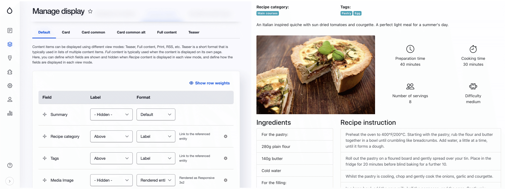

> The DruxtEntity module provides a [Drupal](https://drupal.org) Display Mode powered Entity, Form and Field component system for your [Nuxt.js](https://nuxtjs.org) application.


### DruxtEntity

The DruxtEntity component renders content entities using Drupal's View display modes.

```vue
<DruxtEntity :type="resourceType" :uuid="uuid" mode="displayMode" />
```



Get started with the [Guide](guide/) and [API Documentation](/api/components/DruxtEntity.html).


### DruxtEntityForm

The DruxtEntityForm component uses Drupal's Form displays modes for content creation and editing.

```vue
<DruxtEntityForm :type="resourceType" mode="displayMode" />
```


Get started with the [Guide](guide/) and [API Documentation](/api/components/DruxtEntityForm.html).


## DruxtJS

DruxtJS is a suite of modules to connect a [Drupal](https://drupal.org) JSON:API backend to a [Nuxt.js](https://nuxtjs.org) frontend.

Find out more at [https://druxtjs.org](https://druxtjs.org)
