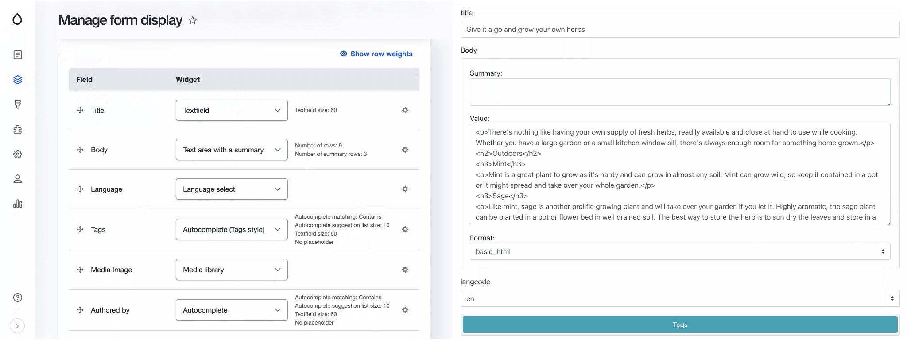

# DruxtJS Entity

The DruxtJS Entity module provides a Drupal **Display mode** powered Entity, Form and Field **component system** for your Nuxt.js frontend.


## Features

- [Nuxt module](#nuxt-module)
- [DruxtEntity component](#druxtentity-component)
- [DruxtEntityForm component](#druxtentityform-component)
- [DruxtField component](#druxtfield-component)
- [Druxt Module wrapper theming support](#theming)
- [Druxt Module settings](#module-settings)
- [DruxtRouter support](#router-support)
- [Auto-generated Nuxt Storybook integration](#storybook)


## Nuxt module

The DruxtEntity module provides Vue.js components and a Nuxt module, among other things.

The Nuxt module installs all required components and dependencies, however most components can be used individually in any Node project.

```js
module.exports = {
  modules: ['druxt-entity'],
  druxt: { baseUrl: 'https://demo-api.druxtjs.org' },
}
```

See [Getting started](/guide/getting-started) and the [API documentation](/api) for more details.


## DruxtEntity component

The `DruxtEntity` component fetches the Entity JSON:API resource and schema data to render the Entities fields based on the Drupal Display Mode configuration.

```vue
<DruxtEntity :type="resourceType" :uuid="uuid" mode="displayMode" />
```


See the [DruxtEntity component API documentation](/api/components/DruxtEntity.html).


## DruxtEntityForm component

The `DruxtEntityForm` component uses Drupal's Form displays modes for content creation and editing.

In addition to rendering the form, the component provides submit and error handling, emitting the relevant data as required.

```vue
<DruxtEntityForm
  :type="resourceType"
  :uuid="uuid"
  mode="displayMode"
  @error="onError()"
  @reset="onReset()"
  @submit="onSubmit()"
/>
```



See the [DruxtEntityForm component API documentation](/api/components/DruxtEntityForm.html).


## DruxtField component

The `DruxtField` component is used by the `DruxtEntity` and `DruxtEntityForm` components to render the Field items of a Drupal Entity or form.

The component uses the JSON:API resources attribute data and schema information to determine the appropriate Field component to render the data.

**Example**

_Using the `<DruxtField />` component to render a `text_default` field._

```vue
<DruxtField
  :data="{
    format: 'basic_html',
    processed: '<p><strong>Umami Magazine &amp; Umami Publications</strong> is a fictional magazine and publisher for illustrative purposes only.</p>',
    value: '<strong>Umami Magazine & Umami Publications</strong> is a fictional magazine and publisher for illustrative purposes only.'
  }"
  :schema="{
    id: 'field_disclaimer',
    label: {
      position: 'above',
      text: 'Disclaimer'
    },
    type: 'text_default'
  }"
/>
```

See the [DruxtField API documention](/api/components/DruxtField.html) for more information.


## Theming

Both the Entity and Field components use the DruxtModule slot based Wrapper theme system.

This allows for Entity Type component wrappers, custom Field components and more.

See the [Wrapper theme system](https://druxtjs.org/guide/#wrapper-theme-system) guide for more information.


## Module settings

### Reducing Entity data

The default behaviour of the Entity module is to retrieve all available fields from the JSON:API.

This behaviour is configurable using the modules `query` option, allowing for both manually filtered `fields`, automatically filtered fields using the Display mode `schema`, and a combination of the two as required.

The default behaviour can be set via `nuxt.config.js`:
```js
druxt: {
  entity: {
    query: {
      fields: ['path', 'title'],
      schema: true,
    },
  },
}
```

Alternatively, the behaviour can be set directly on an Entity Wrapper component:
```js
druxt: {
  query: {
    fields: ['title'],
    schema: false,
  }
}
```


## Router support

Adds Entity Page support via the [DruxtRouter module](https://router.druxtjs.org) and the [Decoupled Router module](https://www.drupal.org/project/decoupled_router).


## Storybook

DruxtEntity provides zero-config, auto generated Storybook integration with a live data connnection to your Druxt backend.

See [Gettings started](/guide/getting-started) for more information.
